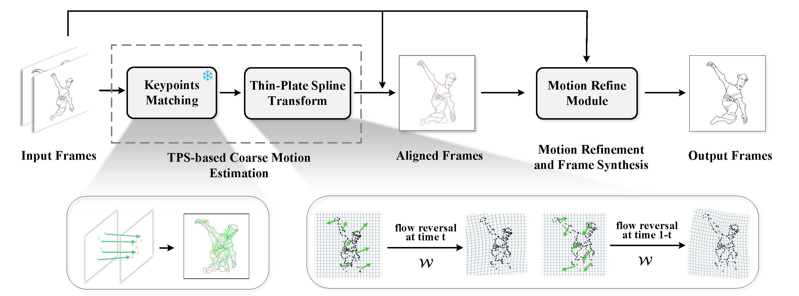

# Thin-Plate Spline-based Interpolation for Animation Line Inbetweening
#### Tianyi Zhu, Wei Shang, Dongwei Ren<sup>*</sup>, Wangmeng Zuo 
This repository is the official PyTorch implementation of "Thin-Plate Spline-based Interpolation for Animation Line Inbetweening".

## ✨ News/TODO
- [x] Examples on  MixiamoLine240 of TPS-Inbetween.
- [x] Source code  of inference demo and pretrained weight. 
- [ ] Source code  of mannual matching demo.


## 🖼️ Resluts

<table class="center">
    <tr style="font-weight: bolder;text-align:center;">
        <td>Input starting frame</td>
        <td>Input ending frame</td>
        <td>Inbetweening results</td>
    </tr>
  <tr>
  <td>
    
  </td>
  <td>
    
  </td>
  <td>
    
  </td>
  </tr>
  <tr>
  <td>
    
  </td>
  <td>
    
  </td>
  <td>
    
  </td>
  </tr>
  <tr>
  <td>
    
  </td>
  <td>
    
  </td>
  <td>
    
  </td>
  </tr> 
</table>


## 📖 Overview


<p align="center">
  
  </br>
  An overview of the pipeline.
</p>


## ⚙️ Run inference demo
1) Download the [Gluestick](https://github.com/cvg/GlueStick) weights and put them in './model/resources'.
2) Download the TPS-Inbetween pretrained weights [here](https://drive.google.com/file/d/1B15f04lrfClFE34vP_ecHm5WEDTqN6iJ/view?usp=sharing) and then put it in the './ckpt' directory. 
3) Run the following command to get inbetweening results.
``` shell
python demo.py --image1 'assets/input1_0.png' --image2 'assets/input1_1.png' --xN 30 --save_path './output' 
```

You can change 'xN' to get arbitrary frame rates results. The reuslts are saved in the folder './output'.
